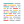

<h1 align="center"> 📚 Tech Stack 📚 </h1>

<h3 align="center"> Languages </h3>

  
  
  

<h3 align="center"> Frontend </h3>

  
  
  
  

<h3 align="center"> Tools </h3>

  
  
  
  
  
  
  
  

<h3 align="center"> Coorperation & Communication </h3>

  
  
  
  
  
  

<h3 align="center"> Design </h3>

  

<h1 align="center"> 👾 Github Stats 👾 </h1>

  
    
  
    
  

